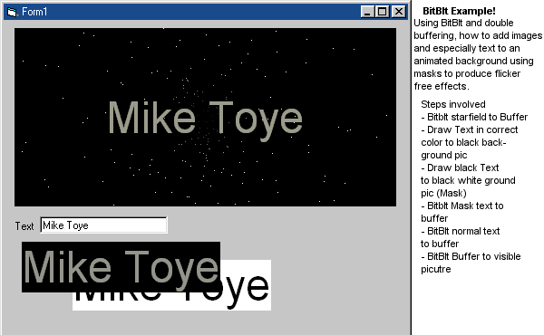



## Use BitBlt Masks for flicker free animation

### Description

Call me sad, but I wanted a moving starfield with fading in text for my splash screen. Using bitBlt, masking and frame buffering, it can easily be done looking professional and flicker free! (The *dynamic* masking of the text enables the stars to pass behind the gaps in the text)

If you type in new text it'll fade it back in from black.

Remember it doesn't have to be a starfield or text, but it shows how BitBlt'ng everything to a buffer first really makes a difference when producing flicker free gfx.

Please comment and vote.
 
### More Info
 

             |
---                |---
**Submitted On**   |2003-05-14 04:29:08
**By**             |[Fosters](https://github.com/Planet-Source-Code/PSCIndex/blob/master/ByAuthor/fosters.md)
**Level**          |Intermediate
**User Rating**    |5.0 (15 globes from 3 users)
**Compatibility**  |VB 5\.0, VB 6\.0
**Category**       |[Graphics](https://github.com/Planet-Source-Code/PSCIndex/blob/master/ByCategory/graphics__1-46.md)
**World**          |[Visual Basic](https://github.com/Planet-Source-Code/PSCIndex/blob/master/ByWorld/visual-basic.md)
**Archive File**   |[Use\_BitBlt1587555142003\.zip](https://github.com/Planet-Source-Code/fosters-use-bitblt-masks-for-flicker-free-animation__1-45465/archive/master.zip)

### API Declarations

BitBlt, Get/SetPixel

